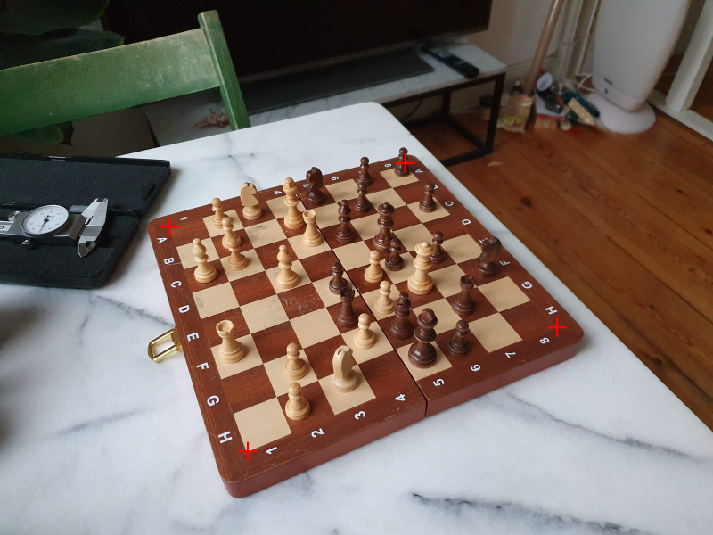
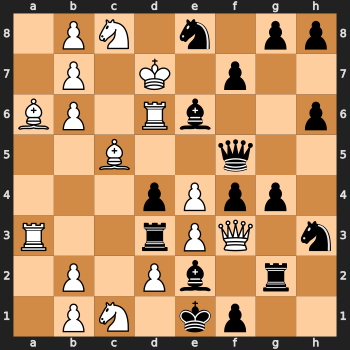

# Real chessboard to FEN conversion

### The goal of this repo is to extract the board configuration from a chessboard image.

#### Example
1. Input Image
    
    

2. Detection of board corners with ML pose estimation

    

3. Classification of chess figures
    
    
