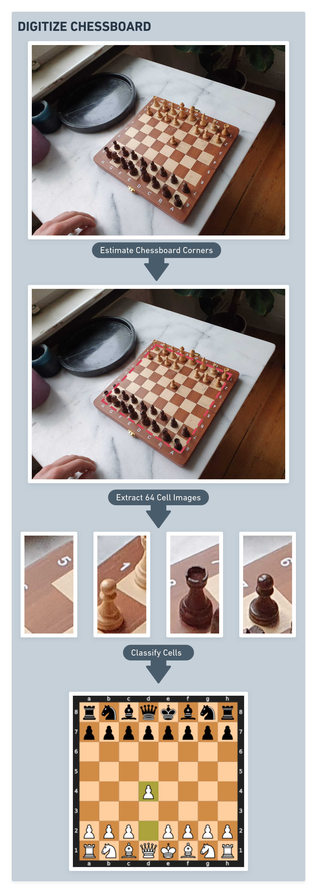

<!-- PROJECT LOGO -->
<br />
<p align="center">

  <h1 align="center">Digitizing Chess Moves From Video</h3>

  <p align="center">
    Computer-Vision pipeline for extracting chess relevant information from images or videos
    <br />
  </p>
</p>


<!-- TABLE OF CONTENTS -->
<details open="open">
  <summary><h2 style="display: inline-block">Table of Contents</h2></summary>
  <ol>
    <li>
      <a href="#about-the-project">About The Project</a>
      <ul>
        <li><a href="#method">Method</a></li>
        <li><a href="#built-with">Built With</a></li>
      </ul>
    </li>
    <li>
      <a href="#getting-started">Getting Started</a>
      <ul>
        <li><a href="#installation">Installation</a></li>
      </ul>
    </li>
    <li><a href="#usage">Usage</a></li>
    <li><a href="#license">License</a></li>
    <li><a href="#contact">Contact</a></li>
  </ol>
</details>


<!-- ABOUT THE PROJECT -->
## About The Project


The goal of this repo is to extract and digitize a chess match from images or a video source. Images can be taken from any perspective of the board as long as all pieces are still partly visible. The digitization makes it possible to play against a chessbot or against someone online on a physical chessboard.


### Method

The digitization is split into 3 parts. First the 4 corners of the chessboard are detected using a neural net performing pose estimation. The board is then split into 64 images representing each checkerboard cell. These images are classified with another neural net. 

In the last step the proposed estimated board will be compared to the current legal board moves. This fusion of information can greatly increase robustness. If a proposed move passes this check it will be appended to the stack of moves.

A YOLO based hand detector is currently being tested to avoid wrong board estimations during a chess move.

Processing of a frame takes roughly 0.8 seconds on a Laptop with i7-8550u and an MX150. At this point the detection and classification models are only trained on this specific chessboard.


<p align="center">

</p>

### Built With

* [Tensorflow](https://www.tensorflow.org/)
* [OpenCV](https://opencv.org/)
* [NumPy](https://numpy.org/)
* [python-chess](https://github.com/niklasf/python-chess)


<!-- GETTING STARTED -->
## Getting Started

To get a local copy up and running follow these steps.

### Installation

1. Clone the repo
   ```sh
   git clone https://github.com/aelmiger/chessboard2fen.git
   cd chessboard2fen
   ```
2. Install requirements
   ```sh
   pip install -r requirements.txt
   ```
**It is important that the Tensorflow version is 2.2**

For a live analysis of the current chessboard place the stockfish binaries of your operating system here: `engine/stockfish`
<!-- USAGE EXAMPLES -->
## Usage

```sh
python3 detectionScript.py
```
<!-- LICENSE -->
## License

Distributed under the MIT License. See `LICENSE` for more information.


<!-- CONTACT -->
## Contact

Anton Elmiger - [anton.elmiger@gmail.com](mailto:anton.elmiger@gmail.com) - email